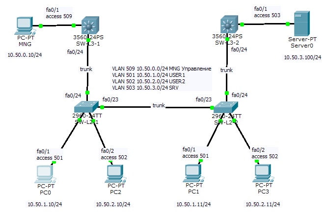
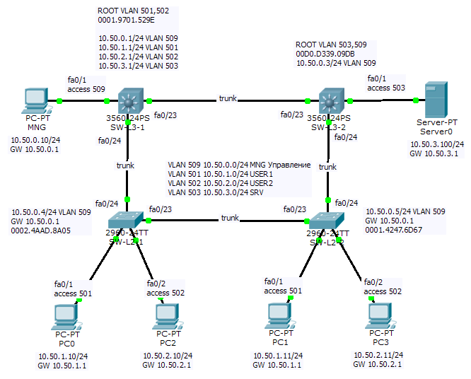

# Cisco. Курс сетевых технологий.

- [Запись лекций (youtube)](https://www.youtube.com/playlist?list=PLhUar1yMUpOuFKesVjs3hcyp3lu8cr7fD)

1. [VLAN](#vlan)
- [Определение диапазона сети по маске, разделение сетей. Задачи](#определение-диапазона-сети-по-маске-разделение-сетей-задачи)
- [Cisco PT](#cisco-pt)
2. [STP(RPVST)](#stprpvst)
        - [Алгоритм работы STP](#алгоритм-работы-stp)
        - [Примеры STP](#примеры-stp)
        - [Cisco PT](#cisco-pt-1)
3. [EtherChannel LACP](#etherchannel-lacp)
4. [InterVLAN routing](#intervlan-routing)
5. [DHCP](#dhcp)
6. [Протокол HSRP](#протокол-hsrp)
7. [Статические маршруты](#статические-маршруты)
8. [Протокол EIGRP](#протокол-eigrp)
9. [OSPF](#ospf)
10. [BGP](#bgp)
11. [NAT](#nat)
12. [Протоколы управления SNMP NTP Syslog CDP](#протоколы-управления-snmp-ntp-syslog-cdp)
13. [Прикладные протоколы DNS FTP TFTP HTTP](#прикладные-протоколы-dns-ftp-tftp-http)

## VLAN

### Определение диапазона сети по маске, разделение сетей. Задачи

Теория в файле `Определение диапазона сети по маске.pdf`.


Задача 1.
*Сколько адресов имеется в сети 10.0.1.0 /27?*

32-27=5 2^5=32

Ответ: **32**

---

Задача 2.
*Переведите префикс /29 в десятичную маску сети.*

32-29=3 2^3=8 256-8=248 

Ответ: **255.255.255.248**

---

Задача 3.
*Переведите десятичную маску сети 255.255.255.240 в префикс.*

256-240=16 16=2^4 32-4=28 

Ответ: **/28**

---

Задача 4.
*Каков допустимый диапазон хостов у сегмента, в котором имеется IP-адрес 172.16.11.24 c маской 255.255.255.240?*

256-240=16 16=2^4 32-4=28 /28
S=2^4=16 Q=16 172.16.11.16-172.16.11.31

Ответ: **172.16.11.17-172.16.11.30**

---

Задача 5.
*Каков допустимый диапазон хостов у сегмента, в котором имеется IP-адрес 10.15.21.65 /30?*

S=2^2=4 Q=64 10.15.21.64-10.15.21.67

Ответ: **10.15.21.65-10.15.21.66**

---

Задача 6.
*Каков допустимый диапазон адресов у сегмента, в котором имеется IP-адрес 10.15.21.66 /30?*

Q=2^2=4 S=64 

Ответ: **10.15.21.64-10.15.21.67**

---

Задача 7.
*Каков допустимый диапазон хостов у сегмента, в котором имеется IP-адрес 192.168.65.89 /23?*

Q=2^1=2 S=64 192.168.64.0-192.168.65.255

Ответ: **192.168.64.1-192.168.65.254**

---

Задача 8.
*Какой допустимый диапазон адресов у сегмента, в котором имеется IP-адрес 10.18.85.14 /9?*

Q=2^7=128 S=0 

Ответ: **10.0.0.0-10.127.255.255**

---

Задача 9.
Даны 4 подсети.
1. 10.3.128.0
2. 10.3.129.0
3. 10.3.130.0
4. 10.3.131.0

Просуммируйте подсети и найдите маску, которая сможет покрыть их, не задевая при этом соседние подсети.

10000000
10000001
10000010
10000011
/22 

Ответ: **10.3.128.0 255.255.255.252.0**

---

Задача 10.
Разделите сеть 192.168.1.0/24 на 3 разные подсети.
1. Подсеть на 120 адресов.
2. Подсеть на 12 адресов.
3. Подсеть на 5 адресов.

120+3~128
12+3~16
4+3~8

Ответ:

- 192.168.1.0-192.168.1.127 /25
- 192.168.1.128-192.168.1.143 /28
- 192.168.1.144-192.168.1.1151 /29

### Cisco PT



1. Настроить имена устройств.

```
Switch(config)#hostname SW-L2-1
```

2. Создать и именовать VLAN'ы.

```
SW-L2-1(config)#vlan 501
SW-L2-1(config-vlan)#name USER1
```

3. Настроить ACCESS порты.

```
SW-L2-1(config)#interface fastEthernet 0/1
SW-L2-1(config-if)#switchport mode access
SW-L2-1(config-if)#switchport access vlan 501
```

4. Настроить TRUNK порты. Чтобы случайно не затереть vlan'ы, можно использовать `add`. Для L3 дополнительно коммутаторов указать формат тегирования фреймов dot1q.

```
SW-L2-1(config)#interface range fastEthernet 0/23-24
SW-L2-1(config)#switchport mode trunk
SW-L2-1(config)#switchport trunk allowed vlan 501,502,503
SW-L2-1(config)#switchport trunk allowed vlan add 509

SW-L3-1(config-if)#switchport trunk encapsulation dot1q
```

5. Проверить настройки.

```
SW-L3-1#show vlan brief
SW-L3-1#show interfaces trunk
SW-L3-1#show running-config
```

## STP(RPVST)

### Алгоритм работы STP


### Примеры STP


### Cisco PT


1. Включить протокол rapid-pvst.

```
SW-L2-1(config)#spanning-tree mode rapid-pvst
```

2. Для коммутаторов, которые станут ROOT, выставить соответвующие приоритеты (отдельно для каждого VLAN'а).

```
SW-L2-1(config)#spanning-tree vlan 501 priority 4096
```

3. После схождения проверить настройки.

```
SW-L2-1#show spanning-tree summary
SW-L2-1#show spanning-tree interface fastEthernet 0/23
```

## EtherChannel LACP


1. Выключить интерфейсы. Опционально, сбросить их настройки, чтобы отдельно настроить логический канал как одно целое.

```
SW-L3-1(config)#interface range fastEthernet 0/22-23
SW-L3-1(config-if-range)#shutdown
SW-L3-1(config-if-range)#no switchport trunk allowed vlan 501-503,509
SW-L3-1(config-if-range)#no switchport mode trunk
SW-L3-1(config-if-range)#no switchport trunk encapsulation dot1q
```

2. Создать каналы, включить LACP, включить интерфейсы. Номера каналов могут не совпадать. Режимы active/passive.

```
SW-L3-1(config-if-range)#channel-protocol lacp
SW-L3-1(config-if-range)#channel-group 1
SW-L3-1(config-if-range)#channel-group 1 mode active
SW-L3-1(config-if-range)#no shutdown
```

3. Проверить настройки.

```
SW-L3-1#show etherchannel summary
```

## InterVLAN routing



1. Включить маршрутизацию на SW-L3-1 коммутаторе и создать SVI.

```
SW-L3-1(config)#ip routing
SW-L3-1(config)#interface vlan 501
SW-L3-1(config-if)#ip address 10.20.1.1 255.255.255.0
```

2. На всех коммутаторах настроить аутентификацию и включить telnet.

```
SW-L3-1(config)#username cisco privilege 15 password cisco
SW-L3-1(config)#enable password enable 
SW-L3-1(config)#line vty 0 15
SW-L3-1(config-line)#login local
```

3. На L2 настроить интерфейсы управления (не забыть добавить default gateway). На SW-L3-2 достаточно создать SVI.

```
SW-L2-1(config)#interface vlan 509
SW-L2-1(config-if)#ip address 10.20.0.4 255.255.255.0
SW-L2-1(config)#ip default-gateway 10.20.0.1
```

4. Добавить default gataway на хостах.

5. Проверить настройки.

```
SW-L3-1#show vlan interface brief
PC1>tracert 10.50.0.10
PC1>telnet 10.50.0.1
```

## DHCP


1. Включить DHCP на SW-L3-1

```
SW-L3-1(config)#service dhcp
```

2. Исключить адреса. Создать пул, в нем назначить сеть в которой будет работать dhcp и определить параметры, которые будут получать клиенты.

```
SW-L3-1(config)#ip dhcp excluded-address 10.50.1.0 10.50.1.50
SW-L3-1(config)#ip dhcp excluded-address 10.50.1.100 10.50.1.254
SW-L3-1(config)#ip dhcp pool VLAN501
SW-L3-1(dhcp-config)#network 10.50.1.0 255.255.255.0
SW-L3-1(dhcp-config)#default-router 10.50.1.1
SW-L3-1(dhcp-config)#dns-server 10.50.3.100
```

3. Включить DHCP на хостах.

4. Проверить настройки.

```
SW-L3-1#show ip dhcp binding
SW-L3-1#debug ip dhcp binding
PC1>ipconfig /renew
```

## Протокол HSRP


1. Создать недостающие SVI интерфейсы на SW-L3-2 и включить маршуртизацию. Изменить их адреса на +1, чтобы освободить адреса для виртуальных IP HSRP группы.

2. Для каждого SVI на всех L3 коммутаторах насторить HSRP. Опционально, можно сбалансировать приоритетами трафик от разных VLAN'ов.

```
SW-L3-1(config)#interface vlan 501
SW-L3-1(config-if)#ip address 10.50.1.2 255.255.255.0
SW-L3-1(config-if)#standby 1 priority 110
SW-L3-1(config-if)#standby 1 ip 10.50.1.1
SW-L3-1(config-if)#standby 1 preempt
```

3. Проверить настройки.

```
SW-L3-1#show standby brief
PC1>ping 10.50.3.100 -n 10000
```

## Статические маршруты


1. Добавить интерфейсы на RO1. Настроить hostname, аутентификацию и интерфейсы на RO1/RO2.

2. Настроить статическую маршуртизацию на RO1 и RO2.

```
RO1(config)#ip route 10.50.0.0 255.255.252.0 10.50.7.1
RO1(config)#ip route 10.50.0.0 255.255.252.0 10.50.7.5
RO1(config)#ip route 10.50.4.0 255.255.255.128 10.50.7.10
RO2(config)#ip route 0.0.0.0 0.0.0.0 10.50.7.9
```

3. На SW-L3-1/SW-L3-2 настроить L3 интерфейсы к RO1 и добавить маршрут по умолчанию.

```
SW-L3-1(config)#interface fastEthernet 0/10
SW-L3-1(config-if)#no switchport
SW-L3-1(config-if)#ip address 10.50.7.1 255.255.255.252
SW-L3-1(config)#ip route 0.0.0.0 0.0.0.0 10.50.7.2
```

4. Опционально, для одинаковых маршрутов с RO1 можно настроить метрику.

```
RO1(config)#ip route 10.50.0.0 255.255.252.0 10.50.7.5 100
```

5. Метрикой зарезервировать путь между SW-L3-1 и SW-L3-2, если канал между SW-L3-1 и RO1 будет недоступен.

```
SW-L3-1(config)#ip route 0.0.0.0 0.0.0.0 10.50.0.3 100
```

6. Проверить настройки.

```
SW-L3-1(config)#do ping 10.50.7.2
RO1(config)#do show ip route
PC0>ping 10.50.4.10 -n 10000
PC0>tracert 10.50.4.1
```

## Протокол EIGRP


1. На L3 устройствах настроить Loopback интерфейсы.

```
SW-L3-1(config)#interface loopback 0
SW-L3-1(config-if)#ip address 10.50.6.1 255.255.255.255
SW-L3-1(config-if)#no shut
```

2. Удалить статические маршруты

```
SW-L3-1(config)#no ip route 0.0.0.0 0.0.0.0 10.50.0.3
SW-L3-1(config)#no ip route 0.0.0.0 0.0.0.0 10.50.7.2

RO1(config)#no ip route 10.50.0.0 255.255.252.0 10.50.7.1
RO1(config)#no ip route 10.50.0.0 255.255.252.0 10.50.7.5
```

3. Настроить EIGRP на SW-L3-1 и SW-L3-2

```
SW-L3-1(config)#router eigrp 50
SW-L3-1(config-router)#network 10.50.7.0 0.0.0.3
SW-L3-1(config-router)#network 10.50.0.0 0.0.0.255
SW-L3-1(config-router)#network 10.50.0.1 0.0.0.255
SW-L3-1(config-router)#network 10.50.0.2 0.0.0.255
SW-L3-1(config-router)#network 10.50.0.3 0.0.0.255
SW-L3-1(config-router)#network 10.50.6.1 0.0.0.0
SW-L3-1(config-router)#no auto-summary
SW-L3-1(config-router)#passive-interface vlan 501
SW-L3-1(config-router)#passive-interface vlan 502
SW-L3-1(config-router)#passive-interface vlan 503
```

4. На RO1 дополнительно указать маршрут по умолчанию который будет отдан на интерфейсы `eth0/0/0` `eth0/1/0`.

```
RO1(config)#interface ethernet 0/0/0
RO1(config-if)#ip summary-address eigrp 50 0.0.0.0 0.0.0.0
RO1(config)#interface ethernet 0/1/0
RO1(config-if)#ip summary-address eigrp 50 0.0.0.0 0.0.0.0
```

5. Проверить настройки

```
RO1(config)#do show ip eigrp int
RO1(config)#do show ip eigrp nei
RO1(config)#do show ip route
```

## OSPF


1. Настроить Loopback интерфейс и удалить маршрут по умолчнаию на RO2.

```
RO2(config)#interface loopback 0
RO2(config-if)#ip address 10.50.6.4 255.255.255.255
RO2(config-if)#no shut
RO2(config)#no ip route 0.0.0.0 0.0.0.0 10.50.7.9
```

2. Настроить OSPF на RO2.

```
RO2(config)#route ospf 50
RO2(config-router)#router-id 10.50.6.4
RO2(config-router)#network 10.50.6.4 0.0.0.0 area 0
RO2(config-router)#network 10.50.7.8 0.0.0.3 area 0
RO2(config-router)#network 10.50.4.0 0.0.0.127 area 0
RO2(config-router)#passive-interface fastEthernet 0/0
```

3. Настроить OSPF на RO1. Дополнительно, произвести редистрибуцию eigrp.

```
RO1(config)#no ip route 10.50.4.0 255.255.255.128 10.50.7.10
RO1(config)#router ospf 50
RO1(config-router)#router-id 10.50.6.3
RO1(config-router)#network 10.50.7.8 0.0.0.3 area 0
RO1(config-router)#network 10.50.6.3 0.0.0.0 area 0
RO1(config-router)#redistribute eigrp 50 subnets
RO1(config-router)#redistribute eigrp 50 metric-type 1 subnets
```

4. Проверить настройки.

```
RO1(config-router)#do show ip ospf int
RO1(config-router)#do show ip ospf nei
RO2(config-router)#do show ip route
RO2(config-router)#do show ip ospf data
```

## BGP


1. Настроить новые устройства. Маршрутизатор ISP играет роль первого маршрутизатора провайдера, а Server1 устройства в интернете.

2. Настроить eBGP на RO1 и ISP.

```
ISP(config)#router bgp 65001
ISP(config-router)#neighbor 192.168.0.1 remote-as 65000
ISP(config-router)#network 8.8.8.0 mask 255.255.255.0

RO1(config)#router bgp 65000
RO1(config-router)#neighbor 192.168.0.254 remote-as 65001
```

3. Отдать маршрут по умолчанию с RO1 на RO2, чтобы с хоста PC4 был доступ не только в сеть 10.50.0.0/22.

```
RO1(config)#router ospf 50
RO1(config-router)#default-information originate
```

4. Проверить настройки.

```
RO1(config-router)#do show ip bgp sum
RO1(config-router)#do show ip bgp
```

## NAT


1. Настроить интерфейсы для NAT.

```
RO1(config)#interface fastEthernet 0/1
RO1(config-if)#ip nat inside 
...
RO1(config)#interface fastEthernet 0/0
RO1(config-if)#ip nat outside
```

2. Настроить ACL для правила NAT.

```
RO1(config)#access-list 50 permit 10.50.1.0 0.0.0.255
RO1(config)#access-list 50 permit 10.50.2.0 0.0.0.255
RO1(config)#access-list 50 permit 10.50.4.0 0.0.0.255
```

3. Включить перегруженый NAT.

```
RO1(config)#ip nat inside source list 50 interface fastEthernet 0/0 overload
```

4. Проверить настройки.

```
RO1#show ip nat statistics 
RO1#show ip nat translations 
```

## Протоколы управления SNMP NTP Syslog CDP


1. Включить сервис SNMP

```
RO1(config)#snmp-server community public RO
```

2. Включить сервис Syslog

```
RO1(config)#logging 10.50.3.100
RO1(config)#logging trap debugging
```

3. Включить и проверить синхронизацию времени по NTP

```
RO1(config)#ntp server 10.50.3.100 key 0
RO1(config)#do show clock
RO1(config)#do show ntp status
```

4. Запросить информацию по SNMP об состоянии интерфейсов. Узнать о соседях через CDP.

```
PC>snmpgetbulk /v 2 /a 10.50.6.3 /c public /o .1.3.6.1.2.1.2.2.1.8
PC>snmpgetbulk /d

RO1#show cdp neighbors 
RO1#show cdp neighbors detail
```

## Прикладные протоколы DNS FTP TFTP HTTP


1. Включить DNS на Server0. Например, именовать коммутаторы и сам сервер. Проверить доступность с хостов.
2. Аналогично включить FTP/TFTP. Попробовать скачать, загрузить файлы. Попробовать загрузить или скачать на TFT конфиг маршрутизатора.

```
RO1#copy startup-config tftp:
```

3. Включить HTTP сервер, получить страницу с хоста, чтобы проверить как работает в связке с DNS.
